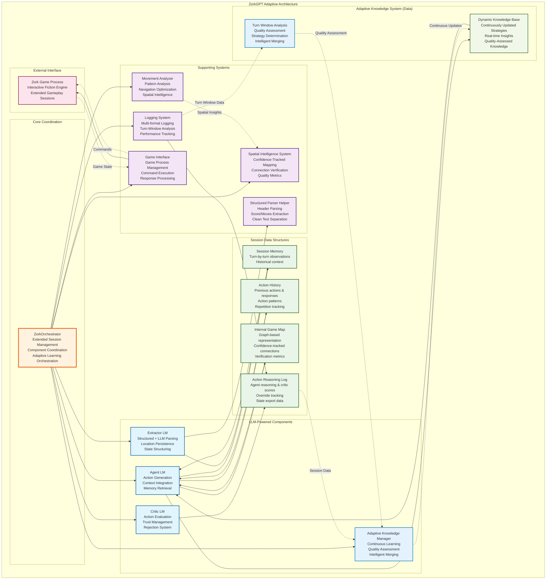
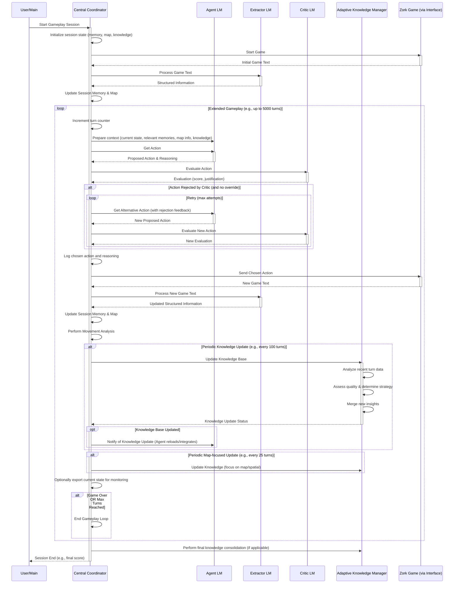

# ZorkGPT: An LLM-Powered Agent for Interactive Fiction

**🎮 Watch ZorkGPT play live at [https://zorkgpt.com](https://zorkgpt.com)**

## Table of Contents

1. [Project Overview](#project-overview)
2. [Core Mission and Design Philosophy](#core-mission-and-design-philosophy)
3. [System Architecture](#system-architecture)
    * [Central Coordinator](#central-coordinator)
    * [Core LLM-Powered Modules](#core-llm-powered-modules)
    * [Supporting Systems](#supporting-systems)
4. [Key Features](#key-features)
    * [Extended Gameplay Sessions](#extended-gameplay-sessions)
    * [Adaptive Knowledge System](#adaptive-knowledge-system)
    * [Spatial Intelligence System](#spatial-intelligence-system)
5. [Data Management](#data-management)
6. [System Flow](#system-flow)
7. [Logging Infrastructure](#logging-infrastructure)
8. [Architecture Diagram](#architecture-diagram)
9. [Turn-by-Turn Flow with Adaptive Learning](#turn-by-turn-flow-with-adaptive-learning)

## Project Overview

ZorkGPT is an AI agent system designed to play the classic interactive fiction game "[Zork](https://en.wikipedia.org/wiki/Zork)" using Large Language Models (LLMs). The project explores how modern language models can understand, navigate, and solve complex interactive environments through natural language reasoning. It aims to achieve genuine AI-driven gameplay by relying on LLM capabilities for all aspects of decision-making and learning, rather than pre-programmed logic or solutions.

The system employs a modular architecture where specialized LLM-driven components handle different aspects of gameplay: action generation, information extraction, action evaluation, and strategic learning. This design allows each component to focus on its specific task while adhering to the core principle that all reasoning originates from the language models. Gameplay occurs over extended sessions, during which the system continuously accumulates knowledge and refines its strategies in real-time.

## Core Mission and Design Philosophy

ZorkGPT operates under several fundamental principles:

* **LLM-First Design**: All game reasoning, decision-making, and understanding must originate from language models. The system deliberately avoids hardcoded game mechanics, location databases, or predetermined solutions.
* **No Hardcoded Solutions**: The only acceptable hardcoded logic is for validating parser acceptance (i.e., did the Zork game engine understand the command). Puzzle solutions, navigation choices, and strategic decisions must emerge from LLM reasoning.
* **Adaptive Learning**: The system implements continuous knowledge extraction and strategy refinement *during* gameplay. The AI analyzes its experiences in real-time, updating its strategic understanding at regular intervals (e.g., every 100 turns). This allows for the immediate incorporation of new insights.
* **Genuine AI Play**: The objective is to have the LLMs genuinely "play" the game, demonstrating authentic language model capabilities in a complex, interactive environment. When LLMs encounter challenges, the approach is to improve prompts, models, or context rather than introducing fallback mechanisms.

## System Architecture

ZorkGPT utilizes a multi-component architecture, coordinated by a central orchestrator, with distinct LLM-powered modules for different cognitive functions, supported by specialized systems for game interaction and data management.

### Jericho Integration

The system leverages the **Jericho** library for direct Z-machine memory access, providing:

* **Direct Z-machine Access**: Instant retrieval of inventory, location, score, and object data without text parsing
* **Integer-based Location IDs**: Stable room identification eliminating fragmentation issues
* **Object Tree Visibility**: Access to game object attributes and valid action verbs
* **Built-in Save/Restore**: Leverages Z-machine state management for session handling
* **Perfect Movement Detection**: Location ID comparison replaces error-prone heuristics

**Performance Benefits:**
- 40% reduction in LLM calls per turn (inventory, location, score now instant)
- 739 lines of parsing/consolidation code eliminated (11-12% of codebase)
- Zero room fragmentation guaranteed by Z-machine IDs
- 15,000+ actions/second processing throughput
- Perfect walkthrough completion (350/350 score)

### Central Coordinator

A **ZorkOrchestrator** class serves as the primary coordinator. It manages extended gameplay sessions (potentially thousands of turns), coordinates the interactions between all other system components, handles the overall game loop, and orchestrates the periodic adaptive knowledge updates.

### Core LLM-Powered Modules

These components form the cognitive core of the agent:

* **Agent LM**: Responsible for generating game actions. It analyzes the current game state, integrates relevant information from session memory, spatial knowledge, and strategic guidance from the knowledge base to decide the next action. Receives structured Z-machine object data for enhanced reasoning.
* **Extractor LM**: Parses raw game text output into structured information. With Jericho integration, extraction is now hybrid: inventory, location, score, and objects come directly from Z-machine memory, while LLM parsing focuses on exits, combat, and important messages. This reduces LLM calls by 40% per turn.
* **Critic LM**: Evaluates proposed actions before execution. It assesses actions based on relevance, potential for progress, risk, and alignment with current strategy, providing a confidence score and justification. This helps filter out suboptimal actions and guides the agent towards more effective gameplay. It also incorporates a trust mechanism that can adapt its strictness based on recent performance. Performs fast object tree validation before expensive LLM calls (83.3% LLM reduction for invalid actions).
* **Adaptive Knowledge Manager (Strategy LM)**: Drives the continuous learning process. This component analyzes gameplay data in real-time (e.g., within 100-turn windows) to identify patterns, successful tactics, and areas for improvement. It assesses the quality of new information and intelligently merges new insights into the existing knowledge base, ensuring that learning is productive and avoids knowledge degradation.

### Supporting Systems

Several systems support the core LLM modules:

* **Game Interface (JerichoInterface)**: Manages low-level interaction with the Z-machine game engine via the Jericho library, providing instant access to game state, inventory, location data, object attributes, and valid action vocabulary.
* **Spatial Intelligence System**: Builds and maintains a dynamic understanding of the game world's layout using integer-based location IDs from the Z-machine, eliminating room fragmentation and enabling perfect movement detection.
* **Logging System**: Captures detailed data from all parts of the system for analysis, debugging, and to provide the raw material for the adaptive learning process.

## Key Features

### Extended Gameplay Sessions

ZorkGPT is designed for multi-thousand turn gameplay sessions. Knowledge and memory persist and evolve throughout these long sessions, allowing for cumulative learning and adaptation over extended periods of interaction with the game world.

### Adaptive Knowledge System

The system features a sophisticated continuous learning pipeline:

* **Real-Time Analysis**: Gameplay data is analyzed during play. For instance, every 100 turns, recent experiences are processed to extract strategic insights.
* **LLM-Driven Assessment**: The determination of what constitutes valuable knowledge and how it should be integrated is itself an LLM-driven process, adhering to the LLM-first principle.
* **Intelligent Merging**: New insights are merged into the existing knowledge base in a way that aims to enhance, rather than overwrite or degrade, prior learning.
* **Dynamic Strategy Guides**: The output of this system is a dynamically updated knowledge base that provides strategic guidance to the Agent LM, influencing its decisions.
* **Dynamic Objective Formulation**: The learning system contributes to identifying and prioritizing high-level objectives. These emergent goals, derived from gameplay analysis and strategic understanding, help guide the agent's long-term decision-making and focus its exploration and actions towards achieving meaningful progress in the game.

### Spatial Intelligence System

Understanding and navigating the game's geography is crucial:

* **Graph-Based Mapping**: A dynamic graph represents the game world, with locations as nodes and connections as edges. Confidence scores are associated with connections, reflecting the agent's certainty about them.
* **Movement Analysis**: The system analyzes movement patterns to verify connections, identify efficient routes, and recognize important spatial features like hubs or dead ends.
* **Contextual Navigation**: Spatial information (current location, known exits, map-based relationships) is provided to the Agent LM to inform its navigation decisions.
* **Intelligent Exit Validation**: Failed movement attempts are tracked. Exits that consistently fail are eventually pruned from the agent's map to prevent repeated errors, based on empirical evidence from gameplay.

## Data Management

Effective gameplay relies on robust data management:

* **Session Memory**: Structured records of turn-by-turn observations, including game text, extracted information, and actions taken, are maintained throughout a session. This provides historical context for decision-making.
* **Dynamic Knowledge Base**: A continuously updated repository of strategic insights, learned heuristics, and important facts about the game world. This knowledge base is curated by the Adaptive Knowledge Manager and directly informs the Agent LM.

## System Flow

A typical gameplay loop involves several stages:

1. **Observation**: The system receives the latest game text from the Z-machine.
2. **Extraction (Hybrid)**:
   - **Instant Z-machine Access**: Inventory, location, score, and visible objects retrieved directly from game memory
   - **LLM Parsing**: Extractor LM processes text for exits, combat, and important messages only
   - Result: 40% fewer LLM calls per turn
3. **State Update**: Session memory and the spatial map are updated with the new information. Movement detection uses location ID comparison (perfect accuracy).
4. **Contextualization**: Relevant memories, spatial data, strategic knowledge, and structured Z-machine object data are assembled for the Agent LM.
5. **Action Generation**: The Agent LM proposes an action, informed by structured object attributes and valid action vocabulary.
6. **Evaluation**: The Critic performs fast object tree validation first (microseconds), then LLM evaluation if needed. If the action is deemed suboptimal, the Agent LM may be prompted for alternatives. Object tree validation reduces LLM calls by 83.3% for invalid actions.
7. **Execution**: The chosen action is sent to the Z-machine game engine.
8. **Learning**: Periodically (e.g., every 25 turns for map-focused updates, every 100 turns for broader strategic updates), the Adaptive Knowledge Manager analyzes recent gameplay to refine the knowledge base. State loop detection alerts when exact game states repeat.

This cycle repeats, allowing the agent to explore, interact, and learn from its experiences in the game world over thousands of turns.

## Logging Infrastructure

Comprehensive logging captures all significant events, LLM interactions, state changes, and decisions. This structured log data is crucial for:

* **Debugging and Analysis**: Understanding system behavior and diagnosing issues.
* **Adaptive Learning**: Providing the raw data (e.g., turn-window information) that the Adaptive Knowledge Manager uses to extract insights and generate new strategies.

The design of the logging system is specifically tailored to support the turn-based analysis required for continuous learning.

## Architecture Diagram

## Turn-by-Turn Flow with Adaptive Learning

