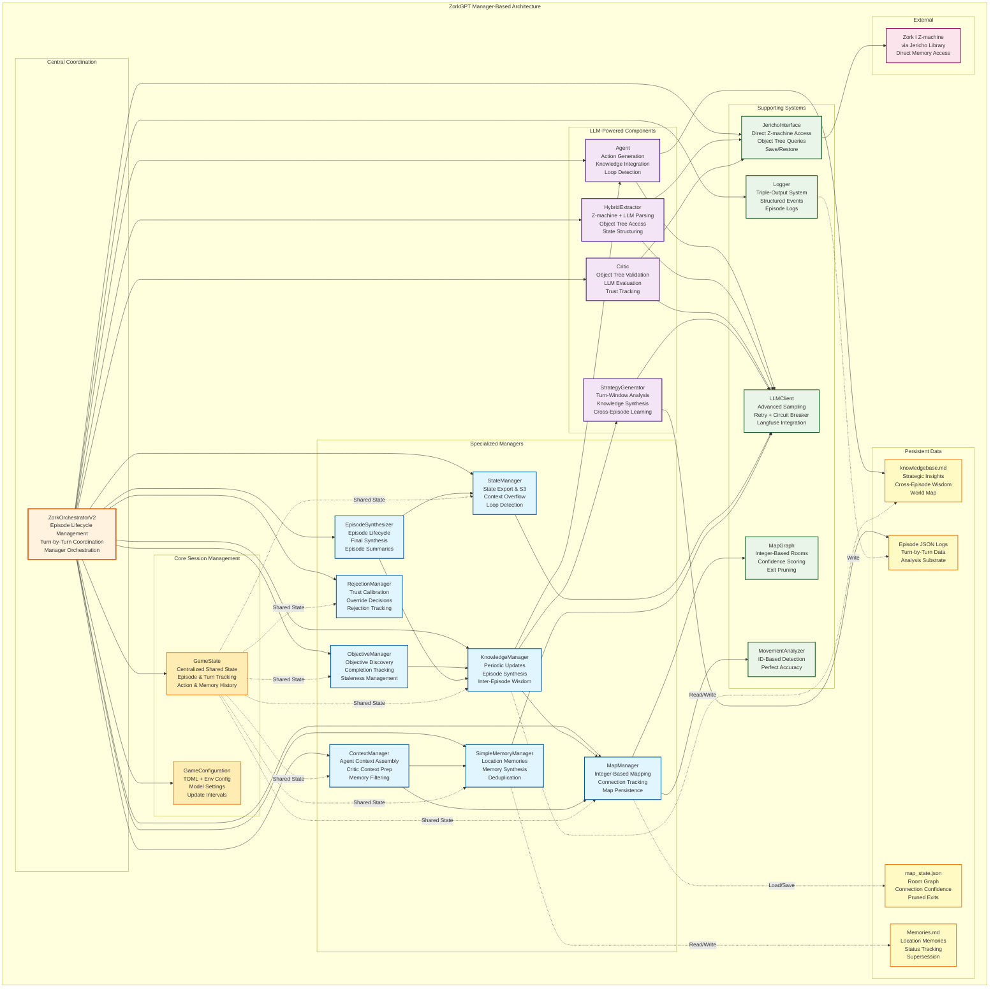

# ZorkGPT: An LLM-Powered Agent for Interactive Fiction

**🎮 Watch ZorkGPT play live at [https://zorkgpt.com](https://zorkgpt.com)**

## Table of Contents

1. [Project Overview](#project-overview)
2. [Quick Start](#quick-start)
3. [Core Research Approach](#core-research-approach)
4. [System Architecture](#system-architecture)
5. [Subsystems](#subsystems)
6. [System Execution Flow](#system-execution-flow)
7. [Architecture Diagrams](#architecture-diagrams)
8. [MCP Integration](#mcp-integration)

## Project Overview

Interactive fiction games like Zork present a compelling challenge for artificial intelligence: they require long-horizon planning, spatial reasoning, puzzle solving, and the ability to learn from failure—all through natural language interaction. Traditional approaches rely on reinforcement learning with carefully shaped rewards or extensive offline training. Can large language models achieve genuine competence in these complex environments through pure reasoning and real-time adaptive learning, without any hardcoded solutions?

ZorkGPT explores this question by demonstrating an AI agent system that plays the classic text adventure game "[Zork](https://en.wikipedia.org/wiki/Zork)" using only LLM-driven reasoning and continuous in-game learning. The system achieves extended gameplay sessions spanning thousands of turns, during which it builds spatial knowledge, discovers objectives, synthesizes strategic insights, and accumulates cross-episode wisdom—all without predetermined solutions or game-specific programming.

The research contribution lies in demonstrating that LLMs can develop authentic gameplay competence through a combination of specialized cognitive modules (action generation, evaluation, knowledge synthesis), direct game state access via the Z-machine, and a sophisticated multi-step learning pipeline that continuously refines strategic understanding during play.

## Quick Start

```bash
# Prerequisites: Python 3.11+, uv installed

# 1. Clone and setup
git clone https://github.com/stickystyle/ZorkGPT
cd ZorkGPT
uv sync

# 2. Configure API keys
cp .env.example .env
# Edit .env with your LLM API keys (OpenAI, Anthropic, etc.)

# 3. Run a gameplay episode
uv run python main.py

# Watch the agent play live or review episode logs in game_files/episodes/
```

## Core Research Approach

ZorkGPT operates under four fundamental research principles:

### LLM-First Design

All game reasoning, decision-making, and understanding must originate from language models. The system deliberately avoids hardcoded game mechanics, location databases, or predetermined solutions. This constraint forces the agent to rely on genuine language model capabilities rather than falling back on programmatic shortcuts.

### No Hardcoded Solutions

The only acceptable hardcoded logic validates whether the game engine accepted a command. Puzzle solutions, navigation choices, and strategic decisions must emerge entirely from LLM reasoning. This ensures that observed competence reflects authentic AI capabilities, not disguised rule-based systems.

### Adaptive Learning During Gameplay

The system implements continuous knowledge extraction and strategy refinement *during* gameplay sessions, not just between them. The agent analyzes its experiences in real-time, updating its strategic understanding at regular intervals (every 100 turns by default). This allows immediate incorporation of new insights and demonstrates online learning capabilities.

### Genuine AI Play

The objective is to have LLMs genuinely "play" the game, demonstrating authentic language model capabilities in complex, interactive environments. When the agent encounters challenges, the solution is to improve prompts, models, or context—never to introduce fallback mechanisms or hardcoded assistance.

## System Architecture

ZorkGPT employs a modular architecture coordinated by a central orchestrator, with specialized LLM-powered components handling distinct cognitive functions and supporting systems managing game interaction and data persistence.

### Central Coordinator

The **ZorkOrchestratorV2** serves as the primary coordination layer, managing extended gameplay sessions that can span thousands of turns. It orchestrates interactions between all system components, handles the main game loop, coordinates periodic knowledge updates, and manages episode lifecycle from initialization through finalization and cross-episode synthesis.

### LLM-Powered Cognitive Modules

Four specialized LLM components form the cognitive core of the agent:

**Agent LM** generates actions by analyzing current game state, integrating memories from previous turns, consulting spatial knowledge from the map system, and following strategic guidance from the knowledge base. It receives structured Z-machine object data including attributes and valid action verbs to inform its reasoning.

**Extractor LM** operates as a hybrid system: it retrieves inventory, location, score, and visible objects directly from Z-machine memory (bypassing text parsing), while using LLM reasoning to extract exits, combat status, and important narrative messages from game text. This hybrid approach reduces LLM calls significantly per turn while maintaining reasoning quality.

**Critic LM** evaluates proposed actions before execution through a two-stage process. It first performs fast object tree validation (microseconds) to catch impossible actions, then conducts LLM-based evaluation assessing relevance, progress potential, risk, and strategic alignment. This reduces expensive LLM calls significantly for invalid actions. The Critic incorporates a trust calibration mechanism that adapts its strictness based on recent agent performance.

**Strategy Generator LM** drives the continuous learning process by analyzing gameplay data within turn windows (typically 100 turns), identifying successful tactics and patterns, and synthesizing strategic insights. It assesses the quality of new information and intelligently merges insights into the existing knowledge base, ensuring productive learning without knowledge degradation.

### Supporting Systems

Several specialized systems support the LLM cognitive modules:

**Jericho Interface** manages low-level interaction with the Z-machine game engine through the Jericho library, providing direct memory access for instant retrieval of inventory, location, score, and object data without text parsing. It uses integer-based location IDs for stable room identification, eliminating fragmentation issues that plague text-based parsing. The interface exposes the object tree for validation and provides built-in save/restore capabilities, enabling perfect movement detection through location ID comparison.

**Map System** builds and maintains a dynamic graph-based representation of the game world using integer location IDs from the Z-machine. It tracks connection confidence scores, analyzes movement patterns, and prunes consistently failing exits based on empirical evidence from gameplay.

**Memory System** implements a multi-step synthesis pipeline that transforms raw action history into location-specific memories and ultimately strategic knowledge. Memories are stored at source locations (not destinations) to enable effective cross-episode learning and are deduplicated to prevent redundancy.

**State Manager** handles game state persistence, context overflow detection (triggering LLM-based summarization when token limits approach), state loop detection (alerting when exact game states repeat), and exports state to local storage and S3.

## Subsystems

### Adaptive Knowledge System

The adaptive knowledge system enables ZorkGPT to improve continuously during gameplay through real-time analysis and knowledge synthesis. Rather than learning only between episodes, the agent analyzes its recent experiences every 100 turns (by default) to extract strategic insights.

The system operates through an LLM-driven assessment process that determines what constitutes valuable knowledge and how to integrate it. The Strategy Generator analyzes turn windows to identify successful tactics, failed approaches, and emerging patterns. New insights are intelligently merged into the existing knowledge base in a way that enhances rather than overwrites prior learning, preventing knowledge degradation.

The output is a dynamically updated knowledge base that provides strategic guidance to the Agent LM, influencing its decisions. The system also contributes to objective discovery and prioritization—high-level goals that emerge from gameplay analysis and help guide the agent's long-term decision-making and exploration focus.

At episode boundaries, particularly after significant progress or failure (death), the system performs cross-episode synthesis to distill validated wisdom that persists across gameplay sessions.

### Spatial Intelligence System

Understanding and navigating Zork's complex geography is crucial for progress. ZorkGPT builds a dynamic graph-based map where locations are nodes identified by stable integer IDs from the Z-machine, and connections are edges with associated confidence scores.

The system achieves perfect movement detection by comparing location IDs before and after actions, eliminating the ambiguity inherent in text-based approaches. Movement patterns are analyzed to verify connections, identify efficient routes, and recognize important spatial features like hub rooms or dead ends.

Spatial information—current location, known exits, map-based relationships—is provided to the Agent LM to inform navigation decisions. The system tracks failed movement attempts and prunes exits that consistently fail, preventing repeated errors based on empirical evidence from gameplay.

### Memory System

ZorkGPT implements a multi-step memory hierarchy that converts raw experiences into strategic understanding:

**Action History** → **Location Memories** → **Strategic Knowledge** → **Cross-Episode Wisdom**

Location-specific memories are synthesized when certain triggers occur: score changes, location changes, deaths, or manual triggers. The Memory Manager uses LLM reasoning to analyze recent actions and outcomes, creating concise memories that capture what happened and why it matters.

Memories are stored at the *source* location where they were created, not at destination locations. This design enables cross-episode learning: when revisiting a location, the agent receives memories from all previous episodes at that location, regardless of when they occurred.

The system handles supersession, allowing new memories to replace or refine earlier ones when better understanding emerges. Deduplication prevents redundant memories from cluttering the knowledge base.

## System Execution Flow

A typical gameplay turn proceeds through these stages:

1. **Observation**: The system receives game text from the Z-machine after the previous action.

2. **Hybrid Extraction**: Inventory, location ID, score, and visible objects are retrieved instantly from Z-machine memory. The Extractor LM parses game text only for exits, combat status, and room description detection.

3. **State Update**: Session memory is updated with new information. The map system compares location IDs to detect movement with perfect accuracy. State hash tracking identifies exact state loops.

4. **Context Assembly**: The Context Manager gathers relevant memories from the current location, spatial data from the map, strategic knowledge from the knowledge base, and structured object data from the Z-machine, assembling a comprehensive context for the Agent LM.

5. **Action Generation**: The Agent LM analyzes the context and proposes an action, informed by object attributes, valid action vocabulary, spatial relationships, and strategic guidance.

6. **Action Evaluation**: The Critic performs fast object tree validation (microseconds). If the action passes, it conducts LLM-based evaluation (~800ms). Low-scoring actions may trigger re-generation with feedback, subject to trust calibration and rejection override logic.

7. **Execution**: The chosen action is sent to the Z-machine game engine.

8. **Periodic Learning**: At regular intervals, specialized updates occur:
   - Every 25 turns: Objective discovery and completion tracking
   - Every 100 turns: Strategic knowledge synthesis and knowledge base updates
   - Every turn: Memory synthesis triggers (score change, location change, death)
   - Continuous: State export, context overflow detection, map updates

This cycle repeats over extended sessions, allowing the agent to explore, learn, and improve over thousands of turns.

## Architecture Diagrams

### Component Architecture

The following diagram illustrates the relationships between ZorkGPT's components in its manager-based architecture. Solid lines show direct dependencies between components, while dashed lines indicate data persistence relationships. The architecture separates concerns into coordination (orchestrator), session management (shared state), specialized managers (objectives, knowledge, map, memory, state, context, episodes, rejection), LLM-powered components (agent, extractor, critic, strategy), supporting systems (Jericho, map graph, logger, LLM client), and persistent data stores.



### Turn-by-Turn Execution Flow

This sequence diagram details the execution flow for a single gameplay turn, showing how the orchestrator coordinates managers, LLM components, the Jericho interface, and persistent data stores. Note the two-stage critic evaluation (fast object tree validation followed by LLM evaluation only when needed), the hybrid extraction process (Z-machine direct access + selective LLM parsing), and periodic update triggers based on turn counts.


## MCP Integration

ZorkGPT supports Model Context Protocol (MCP) to give the agent access to external reasoning tools during gameplay. When enabled, the agent can use [thoughtbox](https://github.com/kastalien-research/thoughtbox) - a structured meta-cognitive reasoning tool that helps with complex puzzle solving.

### Enabling MCP

1. Install thoughtbox locally:
   ```bash
   npm install @kastalien-research/thoughtbox
   ```
   Note: The thoughtbox project recommends npx, but local installation works more reliably.

2. Create `mcp_config.json` in project root:
   ```json
   {
     "mcpServers": {
       "thoughtbox": {
         "command": "node",
         "args": ["node_modules/@kastalien-research/thoughtbox/dist/index.js"],
         "env": {
           "DISABLE_THOUGHT_LOGGING": "true"
         }
       }
     }
   }
   ```

3. Enable in `pyproject.toml`:
   ```toml
   [tool.zorkgpt.mcp]
   enabled = true
   ```

### Disabling MCP

Set `enabled = false` in the `[tool.zorkgpt.mcp]` section of `pyproject.toml`, or remove the section entirely.

### Requirements

- Node.js 22+ (for thoughtbox server)
- Python 3.11+ (for async support)
- mcp package >= 1.22.0 (included in dependencies)
