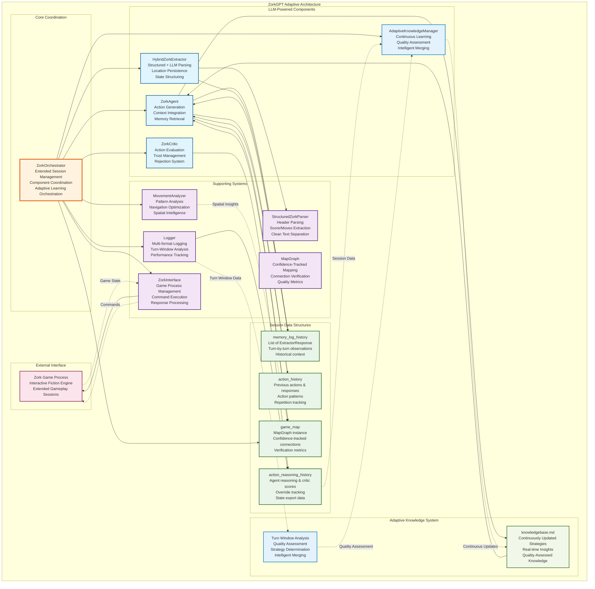

# ZorkGPT: An LLM-Powered Agent for Interactive Fiction

**🎮 Watch ZorkGPT play live at [https://zorkgpt.com](https://zorkgpt.com)**

## Table of Contents

1. [Project Overview](#project-overview)
2. [Core Mission and Design Philosophy](#core-mission-and-design-philosophy)
3. [Modular Architecture](#modular-architecture)
4. [System Components](#system-components)
5. [Adaptive Knowledge System](#adaptive-knowledge-system)
6. [Spatial Intelligence](#spatial-intelligence)
7. [Comprehensive Logging Infrastructure](#comprehensive-logging-infrastructure)
8. [System Flow](#system-flow)
9. [Architecture Diagram](#architecture-diagram)

## Project Overview

ZorkGPT is an AI agent system designed to play the classic interactive fiction game "[Zork](https://en.wikipedia.org/wiki/Zork)" using Large Language Models (LLMs). The project explores how modern language models can understand, navigate, and solve complex interactive environments through natural language reasoning.

The system employs a multi-agent architecture where specialized LLMs handle different aspects of gameplay: action generation, information extraction, action evaluation, and strategic learning. This modular approach allows each component to excel at its specific task while maintaining the core principle that all reasoning comes from language models rather than hardcoded game logic.

The system operates through extended gameplay sessions where knowledge accumulates and refines continuously during play, enabling the AI to learn and adapt its strategies in real-time rather than only between discrete episodes.

## Core Mission and Design Philosophy

### LLM-First Design Principle
ZorkGPT operates under a fundamental **LLM-First Design** principle: all game reasoning, decision-making, and understanding must come from language models. The system deliberately avoids hardcoded game mechanics, location databases, or predetermined solutions. The only acceptable hardcoded elements are parser validation checks to ensure commands are properly formatted for the game engine.

### Adaptive Learning
The system implements continuous knowledge extraction and strategy refinement during gameplay. The AI analyzes its experiences in real-time, updating its strategic understanding every 100 turns. This adaptive approach allows the system to incorporate new insights immediately and adjust its behavior based on recent discoveries.

## Modular Architecture

### Core LLM-Powered Modules

**ZorkOrchestrator** - The primary coordinator that manages extended gameplay sessions, coordinates between subsystems, handles movement tracking, manages logging, and orchestrates adaptive knowledge updates. It serves as the central hub that coordinates all other components and manages the continuous learning process.

**ZorkAgent (Agent LM)** - The action generation engine that decides what the AI should do at each turn. The Agent LM analyzes the current game state, consults memory and spatial knowledge, and generates contextually appropriate actions. It integrates strategic guidance from the continuously updated knowledge base, retrieves relevant memories, formats context for LLM prompts, and generates clean, valid game commands. It receives prompts that include current observations, relevant historical context, strategic guidance from the knowledge base, and spatial awareness from the map system.

**ZorkExtractor (Extractor LM)** - The information parser that converts raw game text into structured data. The Extractor LM processes raw game text into structured information, identifying locations, exits, objects, characters, and important messages. It maintains location persistence for consistent room tracking, supports both enhanced and original extraction modes, and provides JSON parsing with error handling. It maintains consistency in location naming and handles ambiguous game descriptions through parsing logic.

**ZorkCritic (Critic LM)** - The action evaluator that assesses proposed actions before execution. The Critic LM evaluates proposed actions across multiple dimensions including relevance, progress potential, exploration value, risk assessment, and strategic alignment. It provides confidence scoring with detailed justification, implements trust tracking that adapts rejection thresholds based on performance, and includes override mechanisms for edge cases. It provides numerical scores with detailed justifications and adapts its evaluation criteria based on performance feedback.

**AdaptiveKnowledgeManager (Strategy LM)** - The continuous learning system that analyzes gameplay data in real-time. The Strategy LM operates during gameplay to assess the quality of recent experiences, determine appropriate update strategies, and intelligently merge new insights with existing knowledge. It performs turn-window analysis to extract patterns, identifies successful tactics, recognizes dangerous situations, and synthesizes strategic guidance. It operates continuously rather than only at episode boundaries, enabling immediate incorporation of new discoveries.

### Supporting Systems

The architecture includes supporting systems for game interface management, spatial understanding through confidence-tracked mapping, movement pattern analysis, and logging infrastructure. These systems work together to provide the core modules with the information and capabilities they need to function effectively during extended gameplay sessions.

## System Components

### Memory and Context Management
The system maintains memory structures that preserve important information across turns within extended gameplay sessions. The memory system stores structured observations, tracks inventory changes, maintains location histories, and provides relevant context retrieval for decision-making.

Context management ensures that each LLM receives appropriate information without overwhelming token limits. The system prioritizes recent experiences, relevant historical patterns, and strategic insights while maintaining focus on current objectives.

### Spatial Intelligence System
ZorkGPT builds and maintains a dynamic graph-based map of the game world with confidence tracking for connection reliability. This spatial intelligence system tracks room connections with confidence scores, identifies navigation patterns, recognizes hub locations, provides pathfinding capabilities, and verifies connections through repeated traversal.

The map system integrates with the agent's decision-making process, offering spatial context for action selection and enabling exploration strategies. It learns from movement patterns, tracks connection reliability, and adapts to the game's spatial structure over extended gameplay sessions.

## Adaptive Knowledge System

### Continuous Learning Pipeline
ZorkGPT implements an automated learning system that operates continuously during gameplay rather than only between episodes. Every 100 turns, the system analyzes recent gameplay data to extract insights about locations, items, successful strategies, and dangerous situations.

The adaptive knowledge extraction process examines action sequences within turn windows, identifies patterns in successful gameplay, recognizes common failure modes, and synthesizes strategic guidance. This analysis happens entirely through LLM reasoning, maintaining the principle that intelligence emerges from language model capabilities.

### Real-Time Strategic Intelligence
The system generates and updates strategy guides continuously during play, focusing on priority items, navigation routes, puzzle-solving approaches, and safety considerations. These guides provide high-level strategic direction without hardcoding specific solutions and are immediately available to influence subsequent decisions.

Strategic intelligence includes understanding of game mechanics discovered through play, recognition of important items and their uses, identification of dangerous areas and situations, and development of exploration patterns. The adaptive system can identify when the AI is stuck in repetitive patterns and generate escape strategies.

### Intelligent Knowledge Integration
Extracted knowledge integrates into ongoing gameplay through the agent's strategic guidance system. The agent receives updated strategic guidance that improves decision-making while preserving the exploratory and reasoning-based nature of gameplay.

The adaptive knowledge system maintains a balance between providing guidance and preserving the agent's ability to adapt to novel situations and discover new solutions. It employs quality assessment to determine when new experiences warrant knowledge updates and uses intelligent merging to avoid degrading existing knowledge with low-quality insights.

## Spatial Intelligence

### Graph-Based Mapping
The system constructs a dynamic graph representation of the game world where nodes represent locations and edges represent connections with confidence tracking. This spatial model updates continuously as the agent explores, building an understanding of the game's geography while tracking the reliability of discovered connections.

The mapping system handles spatial relationships, bidirectional connections, ambiguous location descriptions, and connection conflicts. It maintains consistency in location identification while adapting to the game's spatial structure and providing confidence metrics for navigation decisions.

### Movement Analysis and Verification
ZorkGPT analyzes movement patterns to identify navigation strategies, recognize hub locations, optimize exploration routes, and verify connection reliability through repeated traversal. This analysis helps the agent avoid redundant exploration while ensuring coverage of the game world and building confidence in spatial understanding.

Movement analysis contributes to strategic planning by identifying key locations, understanding spatial relationships between important areas, developing pathfinding strategies, and detecting when connections may be unreliable or context-dependent.

### Spatial Context Integration
The spatial intelligence system provides detailed context to the agent's decision-making process. This includes current location awareness, available exits with confidence scores, spatial relationships to important areas, navigation recommendations based on connection reliability, and conflict detection for ambiguous spatial relationships.

Spatial context enhances the agent's ability to make decisions about exploration, item retrieval, and strategic positioning within the game world while accounting for the uncertainty inherent in text-based spatial understanding.

## Logging Infrastructure

ZorkGPT implements a logging system that captures all aspects of gameplay for analysis by the adaptive knowledge system. The system generates structured logs of LLM interactions, decision-making processes, game state changes, performance metrics, and learning outcomes that enable the language models to analyze gameplay patterns and extract strategic insights.

The logging infrastructure provides the data foundation for continuous learning, allowing the adaptive knowledge manager to examine turn windows, identify successful strategies, and synthesize new guidance from gameplay experiences.

### Turn-Based Analysis Support
The logging infrastructure supports the adaptive knowledge system by providing structured access to turn-window data for analysis. Each turn receives detailed logging that enables the system to extract action-response patterns, track score changes, monitor location transitions, and identify successful strategies within specific gameplay segments.

## System Flow

### Extended Gameplay Sessions
The system operates through extended gameplay sessions that can span thousands of turns rather than discrete episodes. Each session begins with initialization and knowledge loading from previous sessions, providing continuity and learning progression across gameplay periods.

During gameplay, the system operates in a continuous loop of observation, reasoning, action, learning, and adaptive knowledge updating. Each turn involves memory retrieval, spatial context integration, action generation, critic evaluation, execution, state updating, and periodic knowledge refinement.

### Turn-by-Turn Execution with Adaptive Learning
Individual turns follow a decision-making process that integrates multiple information sources and incorporates continuous learning. The agent consults its memory for relevant historical context, examines spatial relationships through the map system, and incorporates strategic guidance from the continuously updated knowledge base.

Action generation involves prompt construction that provides the Agent LM with context while maintaining focus on current objectives. The Critic LM evaluates proposed actions to prevent obviously poor decisions while preserving the agent's autonomy.

Every 100 turns, the adaptive knowledge system analyzes recent gameplay data to extract new insights and update strategic guidance, ensuring that learning happens continuously rather than only at session boundaries.

### Continuous Learning Integration
The learning process operates continuously throughout gameplay, with real-time learning including map updates, memory consolidation, pattern recognition, and periodic strategic knowledge updates. The adaptive system assesses the quality of potential knowledge updates, determines appropriate analysis strategies, and intelligently merges new insights with existing knowledge.

## Architecture Diagram

## Turn-by-Turn Flow with Adaptive Learning

```mermaid
sequenceDiagram
    participant User as User/Main
    participant Orchestrator as ZorkOrchestrator
    participant Agent as ZorkAgent
    participant HybridExtractor as HybridZorkExtractor
    participant Critic as ZorkCritic
    participant AdaptiveKM as AdaptiveKnowledgeManager
    participant ZorkGame as Zork Game (ZorkInterface)

    User->>Orchestrator: play_episode()
    activate Orchestrator
    
    Orchestrator->>Orchestrator: reset_episode_state()
    
    Orchestrator->>ZorkGame: start()
    activate ZorkGame
    ZorkGame-->>Orchestrator: Initial Game State (S0)
    deactivate ZorkGame

    Orchestrator->>HybridExtractor: extract_info(S0)
    activate HybridExtractor
    HybridExtractor->>HybridExtractor: Try structured parsing first
    HybridExtractor->>HybridExtractor: Use LLM for detailed analysis
    HybridExtractor-->>Orchestrator: ExtractorResponse (E0)
    deactivate HybridExtractor

    Orchestrator->>Orchestrator: Update memory_log_history.append(E0)
    Orchestrator->>Orchestrator: Update game_map with confidence tracking

    loop Extended Gameplay (up to 5000 turns)
        Orchestrator->>Orchestrator: turn_count += 1
        
        Note over Orchestrator: Check combat status from last extraction
        alt Not in combat
            Orchestrator->>ZorkGame: inventory_with_response()
            ZorkGame-->>Orchestrator: current_inventory, inventory_response
        else In combat
            Note over Orchestrator: Skip inventory to avoid death
        end

        Orchestrator->>Agent: get_relevant_memories_for_prompt()
        Agent->>Agent: Process memory_log_history, game_map, action_history
        Agent-->>Orchestrator: relevant_memories

        Orchestrator->>Agent: get_action_with_reasoning(game_state, memories, action_history)
        activate Agent
        Agent->>Agent: Load current knowledge base & format context
        Agent-->>Orchestrator: {action, reasoning, raw_response}
        deactivate Agent

        Orchestrator->>Critic: get_robust_evaluation(game_state, action)
        activate Critic
        Critic->>Critic: Evaluate action with consensus mechanism
        Critic->>Critic: Check trust threshold & rejection system
        Critic-->>Orchestrator: CriticResponse (score, justification, confidence)
        deactivate Critic

        alt Critic score < rejection_threshold
            Note over Orchestrator: Action rejected - attempting alternatives
            loop Max 3 rejection attempts
                Orchestrator->>Critic: Check override conditions
                opt Override conditions met
                    Note over Orchestrator: Override applied - using original action
                end
                opt No override needed
                    Orchestrator->>Agent: Get alternative action with rejection context
                    Orchestrator->>Critic: Re-evaluate new action
                end
            end
        end

        Orchestrator->>Orchestrator: Store action_reasoning_history

        Orchestrator->>ZorkGame: send_command(action)
        activate ZorkGame
        ZorkGame-->>Orchestrator: Game Response (S_t+1)
        deactivate ZorkGame

        Orchestrator->>HybridExtractor: extract_info(S_t+1, previous_location)
        activate HybridExtractor
        HybridExtractor->>HybridExtractor: Structured parsing + LLM analysis
        HybridExtractor->>HybridExtractor: Apply location persistence if needed
        HybridExtractor-->>Orchestrator: ExtractorResponse (E_t+1)
        deactivate HybridExtractor

        Orchestrator->>Orchestrator: Update memory_log_history.append(E_t+1)
        Orchestrator->>Orchestrator: Update game_map with confidence tracking
        Orchestrator->>Orchestrator: Update action_history
        Orchestrator->>Orchestrator: Track movement with MovementAnalyzer
        Orchestrator->>Orchestrator: Reset critic rejection system

        alt Every 100 turns
            Orchestrator->>AdaptiveKM: update_knowledge_from_turns()
            activate AdaptiveKM
            AdaptiveKM->>AdaptiveKM: Assess turn window quality
            AdaptiveKM->>AdaptiveKM: Determine update strategy
            AdaptiveKM->>AdaptiveKM: Perform targeted analysis
            AdaptiveKM->>AdaptiveKM: Intelligent knowledge merging
            AdaptiveKM-->>Orchestrator: Knowledge update result
            deactivate AdaptiveKM
            
            alt Knowledge updated
                Orchestrator->>AdaptiveKM: update_knowledge_with_map()
                Orchestrator->>Agent: reload_knowledge_base()
                Note over Orchestrator: Knowledge successfully updated
            else Knowledge update skipped
                Note over Orchestrator: Update skipped (low quality)
            end
        end

        alt Every 25 turns
            Orchestrator->>AdaptiveKM: update_knowledge_with_map()
            Note over Orchestrator: Map updated more frequently
        end

        Orchestrator->>Orchestrator: export_current_state() (with S3 support)

        alt Game Over OR Max Turns Reached
            Orchestrator->>Orchestrator: Break game loop
        end
    end
    
    Orchestrator->>AdaptiveKM: Final knowledge update if significant progress
    
    Orchestrator-->>User: final_score
    deactivate Orchestrator
    
    Note over Orchestrator, AdaptiveKM: Next session continues with<br/>accumulated knowledge from continuous learning
```

