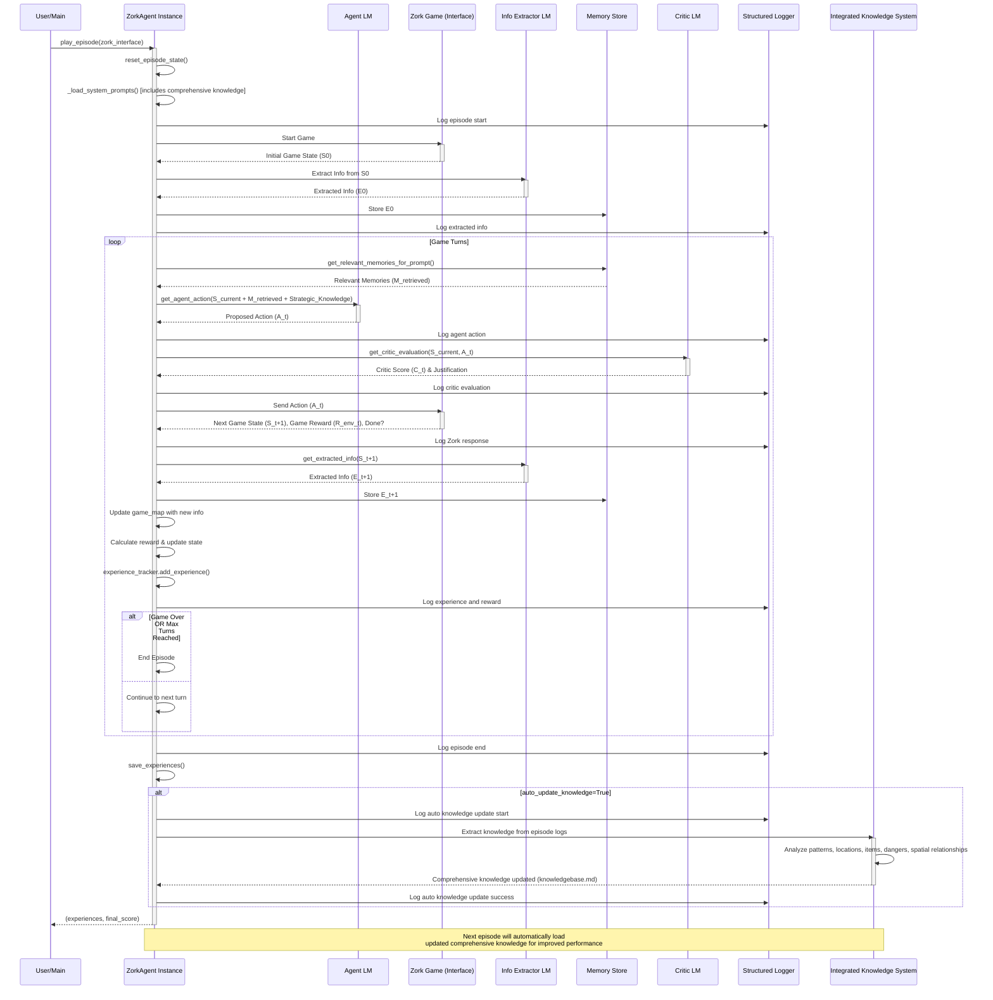

# ZorkGPT: An LLM-Powered Agent for Interactive Fiction

## Table of Contents

1. [Project Overview](#project-overview)
2. [Automatic Knowledge System](#automatic-knowledge-system)
3. [Core Components](#core-components)
4. [Structured Logging System](#structured-logging-system)
   - [Logging Features](#logging-features)
   - [Using the Logger](#using-the-logger)
   - [Processing Log Files](#processing-log-files)
   - [Episode IDs and Correlation](#episode-ids-and-correlation)
   - [Episode Analysis Tools](#episode-analysis-tools)
5. [System Flow](#system-flow)
6. [Flow Diagram](#flow-diagram)
7. [Configuration and Customization](#configuration-and-customization)
8. [Usage Example](#usage-example)

## Project Overview

ZorkGPT is a project aimed at developing an AI agent capable of playing the classic interactive fiction game "[Zork](https://en.wikipedia.org/wiki/Zork)." The system employs Large Language Models (LLMs) to understand the game world, make decisions, and learn from its interactions. The core architecture consists of an Agent LM to play the game, an Information Extraction LM to structure game observations, and a Critic LM to evaluate the agent's actions, all orchestrated within a `ZorkAgent` class that manages episode state, logging, and experience tracking.

The primary goal is to create an agent that can intelligently navigate Zork, solve puzzles, and make progress by leveraging the natural language understanding and generation capabilities of LLMs, augmented by a structured memory system and spatial mapping.

You can view an example run of agent here: [ZorkGPT Example Run](example_episode.txt).

## Automatic Knowledge System

ZorkGPT features a **fully automated learning system** that continuously improves agent performance without manual intervention:

- **🤖 Automatic Learning**: After each episode, the system extracts knowledge from gameplay logs and updates strategic guidance
- **🎯 Strategic Intelligence**: Generates actionable strategy guides focused on priority items, optimal navigation routes, and successful tactics
- **⚠️ Danger Awareness**: Learns from dangerous encounters and failed actions to avoid repeating mistakes  
- **📋 Quick Reference**: Provides optimal starting strategies and item location guides for efficient gameplay
- **⚡ Performance Focus**: Each episode benefits from strategic insights, achieving better exploration and higher scores

The system automatically generates and maintains:
- `knowledgebase.md` - Strategic gameplay guide with priority items, navigation strategies, safety information, and quick reference

This enables the agent to focus on what works, avoid known dangers, and systematically improve performance through strategic learning.

## Core Components

### 1. Zork Game Interface (`ZorkInterface` class)
*   Manages a subprocess running the "Zork" game executable.
*   Handles sending commands to the Zork game via its standard input.
*   Reads and parses game output from Zork's standard output using a separate reader thread and queue to prevent blocking.
*   Provides methods to `start()` the game, `send_command(command)`, `get_response()`, `score()`, and `close()` the game process.
*   Designed to be used as a context manager.

### 2. Agent LM (`ZorkAgent.get_agent_action()`)
*   **Purpose:** To decide what action to take in the game at each step.
*   **Input:** Receives the current game state description (text from Zork), relevant information retrieved from the Memory Store, **and context from the Graph-Based Map (e.g., current location, exits, connections).**
*   **Engine:** An OpenAI LLM (configurable via `agent_model` parameter).
*   **Prompting:** Guided by a detailed system prompt outlining its role as an adventurer, interaction rules (short, clear commands), game mechanics (movement, inventory, looking, examining), and strategic considerations (observation, experimentation, puzzle-solving, avoiding loops).
*   **Output:** A short, Zork-parsable command (e.g., `go north`, `take lamp`).

### 3. Information Extraction LM (`ZorkAgent.get_extracted_info()`)
*   **Purpose:** To parse the raw text output from the Zork game into a structured JSON format.
*   **Input:** Receives the game text output from Zork after each command.
*   **Engine:** An OpenAI LLM (configurable via `info_ext_model` parameter).
*   **Prompting:** Guided by a specific system prompt instructing it to extract key information like:
    *   `current_location_name`
    *   `exits` (list of available directions/actions)
    *   `visible_objects` (list of notable items)
    *   `visible_characters` (list of NPCs/creatures)
    *   `important_messages` (key feedback or events from the last turn)
*   **Output:** A JSON object containing the extracted information.

### 4. Memory Store (`ZorkAgent.memory_log_history`)
*   **Purpose:** To store and manage information extracted from the game over time, allowing the agent to "remember" past observations and events beyond its immediate LLM context window.
*   **Implementation:** A Python list storing the JSON objects produced by the Information Extraction LM (acting as an episodic memory log).
*   **Functionality:**
    *   **Storage:** Appends newly extracted information after each game turn.
    *   **Retrieval:** Provides relevant past information to the Agent LM via `get_relevant_memories_for_prompt()`. This includes:
        *   Current inventory status.
        *   Previously noted objects and exits for the current location.
        *   Important messages or results from the agent's last action.

### 5. Critic LM (`ZorkAgent.get_critic_evaluation()`)
*   **Purpose:** To evaluate the quality or strategic soundness of actions proposed by the Agent LM.
*   **Input:** Receives the current game state description and the Agent LM's proposed action.
*   **Engine:** An OpenAI LLM (configurable via `critic_model` parameter).
*   **Prompting:** Guided by a system prompt defining its role as an expert IF game critic. Evaluation criteria include:
    *   Relevance and contextual awareness.
    *   Progress potential and goal orientation.
    *   Information gathering and exploration.
    *   Plausibility and parser-friendliness.
    *   Problem-solving and resourcefulness.
    *   Repetition and stagnation avoidance.
    *   Risk assessment.
*   **Output:** A JSON object containing a numerical `score` (e.g., -1.0 to +1.0) and a brief `justification` for the score.

### 6. Graph-Based Map (`ZorkAgent.game_map`: `MapGraph` class)
*   **Purpose:** To build and maintain a spatial understanding of the game world.
*   **Structure:** Implemented as a graph where nodes represent rooms and edges represent exits (connections between rooms). Room names, determined through a hybrid approach (prioritizing regex-based extraction from game text, then LLM-based extraction, and persisting the last known valid location if ambiguity arises), serve as unique node identifiers.
*   **Functionality:**
    *   **Map Building:** Dynamically updated after each turn. New rooms are added, and connections are created based on the agent's actions and the resulting game state. It normalizes directional commands (e.g., "n" to "north") for consistent edge representation and handles bi-directional exits where appropriate.
    *   **Context Provision:** Provides structured information to the Agent LM about its current surroundings, including:
        *   The current room's name (according to the map).
        *   How the agent arrived at the current room (previous room and action taken).
        *   Known exits from the current room and their mapped destinations (e.g., "north (leads to Kitchen)", "east (destination unknown)").
*   **Integration:** The map context is added to the information supplied to the Agent LM during prompt construction, augmenting its awareness of the game's layout.

### 7. Automatic Knowledge System (`ZorkAgent._auto_update_knowledge_base()`)
*   **Purpose:** To automatically learn from each episode and continuously improve agent performance without manual intervention.
*   **Components:**
    *   **Knowledge Extractor:** Analyzes episode logs to extract patterns about locations, items, dangerous actions, and successful strategies.
    *   **Spatial Analyzer:** Combines traditional knowledge with spatial intelligence for comprehensive understanding.
    *   **Auto-Integration:** Automatically loads the latest comprehensive knowledge for each new episode.
*   **Functionality:**
    *   **Episode Analysis:** After each episode completion, extracts knowledge from `zork_episode_log.jsonl` including:
        *   Location knowledge (exits, objects, successful/failed actions, danger notes)
        *   Item interactions and properties
        *   Dangerous actions and combat situations (e.g., troll encounters)
        *   Score-gaining actions and puzzle solutions
        *   Common mistakes and effective strategies
    *   **Spatial Analysis:** Combines traditional knowledge with spatial intelligence including:
        *   Movement patterns and room connections
        *   Hub rooms and navigation efficiency
        *   Spatial layout understanding for better exploration
    *   **Integrated Knowledge:** Creates comprehensive understanding combining gameplay patterns with spatial insights
*   **Integration:** The comprehensive knowledge base (`knowledgebase.md`) is automatically loaded into the agent's system prompt for subsequent episodes, enabling continuous improvement without manual knowledge management.

## Structured Logging System

The system includes a comprehensive structured logging system that provides multiple output formats for different use cases:

### Logging Features

1. **Console Output**: Human-readable formatted logs are displayed on stdout during execution
2. **Text Log File**: The same human-readable logs are saved to a text file
3. **JSON Log File**: Structured JSON logs are saved for programmatic processing  
4. **RL Experiences**: Reinforcement learning experiences are collected and can be saved separately

### Using the Logger

Each `ZorkAgent` instance has its own logger that can be configured through constructor parameters:

```python
agent = ZorkAgent(
    episode_log_file="my_episode.log",
    json_log_file="my_episode.jsonl",
    experiences_file="my_experiences.json"
)
```

The logger automatically captures structured events including:
- Episode start/end with model configurations
- Turn-by-turn actions and responses
- Agent proposals and critic evaluations
- Information extraction results
- Reward calculations
- Experience tracking for RL

### Processing Log Files

The system generates JSON logs that can be processed for analysis:

```python
from logger import parse_json_logs, render_logs_as_text

# Parse JSON logs
logs = parse_json_logs("zork_episode_log.jsonl")

# Render as human-readable text  
text_output = render_logs_as_text(logs)

# Format experiences for RL
from logger import format_experiences_for_rl
experiences = agent.experience_tracker.get_experiences()
formatted_data = format_experiences_for_rl(experiences)
```

### Episode IDs and Correlation

Each episode receives a unique episode ID that is an ISO8601 timestamp with resolution to seconds of when the episode started. This ID is included in all log entries for that episode, making it easy to correlate logs across an episode.


#### Example Log Entry
```json
{
  "timestamp": "2024-01-15T10:30:15.123456",
  "level": "INFO",
  "message": "Starting Zork episode...",
  "extras": {
    "event_type": "episode_start",
    "episode_id": "2024-01-15T10:30:15",
    "agent_model": "gpt-4",
    "critic_model": "gpt-3.5-turbo",
    "info_ext_model": "gpt-3.5-turbo"
  }
}
```

### Episode Analysis Tools

#### Usage

```bash
# Show all episodes sorted by score (descending)
python log_tools.py episodes zork_episode_log.jsonl

# Save to file
python log_tools.py episodes zork_episode_log.jsonl -o episodes_report.md

# Show only top 10 episodes
python log_tools.py episodes zork_episode_log.jsonl --limit 10

# Show only episodes with score >= 50
python log_tools.py episodes zork_episode_log.jsonl --min-score 50

# Combine filters: top 5 episodes with score >= 30
python log_tools.py episodes zork_episode_log.jsonl --limit 5 --min-score 30
```

#### Available Log Processing Commands

The `log_tools.py` script provides several commands for processing logs:

- `render`: Convert JSON logs to human-readable text
- `rl`: Extract experiences for reinforcement learning
- `stats`: Show basic statistics (episode count, averages, maximums)
- `episodes`: Generate detailed episode performance tables (new)

#### Episode Report Output

The `episodes` command generates markdown tables with comprehensive episode details:

| Column | Description |
|--------|-------------|
| Episode ID | The unique episode timestamp ID |
| Score | Zork score in format `achieved/maximum` |
| Turns | Number of turns taken in the episode |
| Reward | Total accumulated reward for the episode |
| Status | Episode outcome (Completed, Died, Victory, Game Over) |
| Runtime | Total time taken to complete the episode |
| Agent Model | Model used for the agent |
| Critic Model | Model used for the critic |
| Info Ext Model | Model used for information extraction |

Example output:
```markdown
# Episode Performance Report

| Episode ID | Score | Turns | Reward | Status | Runtime | Agent Model | Critic Model | Info Ext Model |
|------------|-------|-------|--------|--------|---------|-------------|--------------|----------------|
| `2024-01-15T11:45:22` | 85/585 | 18 | 28.2 | Completed | 3m 45s | gpt-4-turbo | gpt-4 | gpt-4 |
| `2024-01-15T10:30:15` | 42/585 | 25 | 15.5 | Completed | 5m 12s | gpt-4 | gpt-3.5-turbo | gpt-3.5-turbo |

## Summary
- **Episodes shown:** 2
- **Average score:** 63.5
- **Average turns:** 21.5
- **Average reward:** 21.9
- **Best score:** 85
```


## System Flow

The interaction between components follows this sequence within the `ZorkAgent.play_episode()` method:

1.  **Initialization:**
    *   The agent resets its episode state using `reset_episode_state()`
    *   The `ZorkInterface` starts the Zork game.
    *   The initial game state is received from Zork.
    *   The Information Extraction LM processes this initial state, and the extracted information is stored in the agent's memory.

2.  **Game Turn Loop:**
    *   **Memory Retrieval:** The agent queries its memory store for information relevant to the current game state **and consults its Graph-Based Map for spatial context.**
    *   **Agent Action Selection:** The Agent LM is prompted with the current game state *and* the retrieved relevant memories. It then proposes an action.
    *   **Critic Evaluation:** The Critic LM evaluates the agent's proposed action, providing a score and justification.
    *   **Action Execution:** The proposed action is sent to the Zork game via the `ZorkInterface`.
    *   **Game Response:** Zork returns the next game state, any game-based rewards (e.g., score changes), and whether the game is over.
    *   **Information Extraction:** The new game state from Zork is processed by the Information Extraction LM.
    *   **Memory Update:** The newly extracted structured information is stored in the agent's memory.
    *   **Map Update:** The agent's spatial map is updated with new location and connection information.
    *   **Experience Tracking:** The turn's experience is logged for reinforcement learning.
    *   **State Update:** The new game state becomes the current state for the next turn.
    *   The loop continues until the game ends or the maximum number of turns is reached.

3.  **Episode Completion:**
    *   Final episode statistics are logged
    *   Experiences are saved to the specified file
    *   **Automatic Knowledge Update:** If enabled (`auto_update_knowledge=True` by default):
        *   The Integrated Knowledge System analyzes all episode logs to extract patterns and update `knowledgebase.md`
        *   Traditional gameplay knowledge is combined with spatial intelligence for comprehensive understanding
        *   Knowledge update events are logged for monitoring and debugging
    *   The agent returns the collected experiences and final game score

## Flow Diagram



## Configuration and Customization

The `ZorkAgent` class supports extensive customization through constructor parameters:

```python
agent = ZorkAgent(
    # Model configuration
    agent_model="gpt-4",
    critic_model="gpt-3.5-turbo",
    info_ext_model="gpt-3.5-turbo",
    
    # Logging configuration  
    episode_log_file="custom_episode.log",
    json_log_file="custom_episode.jsonl",
    experiences_file="custom_experiences.json",
    
    # Game configuration
    max_turns_per_episode=150,
    
    # Automatic Knowledge System configuration
    auto_update_knowledge=True,  # Enable/disable automatic learning
    
    # API configuration
    client_base_url="https://api.openai.com/v1",
    client_api_key="your-api-key"
)
```

Environment variables can also be used for default configuration:
- `AGENT_MODEL`: Default agent model
- `CRITIC_MODEL`: Default critic model  
- `INFO_EXT_MODEL`: Default information extraction model
- `CLIENT_BASE_URL`: OpenAI API base URL
- `CLIENT_API_KEY`: OpenAI API key

## Usage Example

```python
from main import ZorkAgent
from zork_api import ZorkInterface

# Create agent with automatic learning enabled (default)
agent = ZorkAgent(
    agent_model="gpt-4.1",
    max_turns_per_episode=50,
    episode_log_file="my_zork_episode.log",
    auto_update_knowledge=True  # Enables automatic knowledge updates
)

# Play multiple episodes with continuous learning
for episode_num in range(5):
    with ZorkInterface(timeout=0.2) as zork_game:
        try:
            experiences, final_score = agent.play_episode(zork_game)
            print(f"Episode {episode_num + 1} completed! Final score: {final_score}")
            print(f"Collected {len(experiences)} experiences")
            
            # After each episode, knowledge is automatically updated
            # Next episode will benefit from accumulated learning
            
        except Exception as e:
            print(f"Error during episode {episode_num + 1}: {e}")

# Display the generated map from the last episode
print("\nGenerated Map:")
print(agent.game_map.render_ascii())

# Check if comprehensive knowledge was generated
import os
if os.path.exists("knowledgebase.md"):
    print("\n✅ Comprehensive knowledge base generated and available for future episodes")
    with open("knowledgebase.md", "r") as f:
        knowledge_content = f.read()
        print(f"Knowledge base length: {len(knowledge_content)} characters")
```
